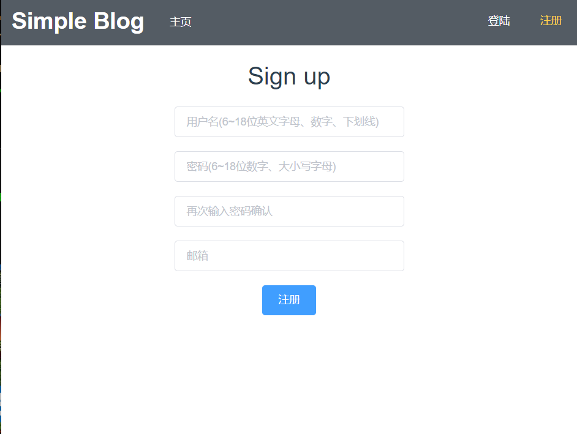

## 简单 web 服务与客户端开发实战
### 小组成员

- 王俊焕 17308154 [【服务计算】简单 web 服务与客户端开发实战小结](https://blog.csdn.net/hunk954/article/details/103444451)

- 温鸿玮 17308164 [go语言学习-简单 web 服务与客户端开发实战](https://blog.csdn.net/sir_beginner/article/details/103439063)

- 颜屹豪 17308195 [web 服务与客户端开发实战总结](https://blog.csdn.net/qq_20549085/article/details/103454127)

- 王鑫基 17309084 [简单 web 服务与客户端开发实战——Simple Blog](https://blog.csdn.net/HiXinJ/article/details/103451041)

### 接口阐述（完成加分项：token认证）

详细见`index.html`

- Article相关

```shell
GET /article/{id}/comments
GET /article/{id} 
GET /articles
```

- User相关

```
POST /article/{id}/comments //发布评论
POST /user/login //登录
POST /user/register //注册
```

- 截图
  
  

  
